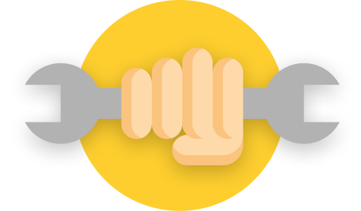
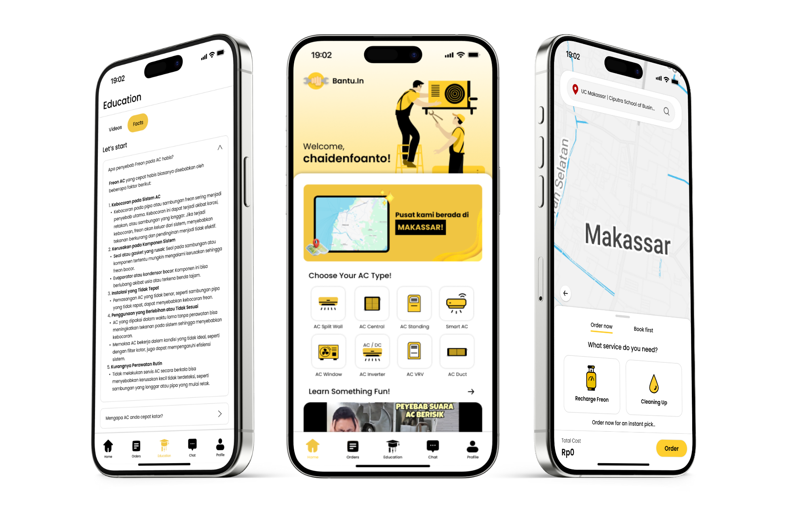

# BantuIn_BACKEND

[](https://github.com/chaidenfoanto/Jobaile_BACKEND/graphs/contributors)

[contributors-shield]: https://img.shields.io/github/contributors/chaidenfoanto/Jobaile_BACKEND.svg?style=for-the-badge]

[](https://www.linkedin.com/in/franklin-jaya-6a3697364/) [](https://www.linkedin.com/in/chaidenfoanto/?locale=en) [](https://www.linkedin.com/in/edrick-lionard-aa5a08282/?locale=en)

[linkedin-shield]: https://img.shields.io/badge/LinkedIn-0A66C2?style=for-the-badge&logo=linkedin&logoColor=white

<!-- PROJECT LOGO -->
<p align="center">
  
</p>
<br />


<!-- TABLE OF CONTENTS -->
<details>
  <summary>Table of Contents</summary>
  <ol>
    <li>
      <a href="#about-the-project">About The Project</a>
      <ul>
        <li><a href="#built-with">Built With</a></li>
        <li><a href="#project-dependencies">Project Dependencies</a></li>
      </ul>
    </li>
    <li>
      <a href="#getting-started">Getting Started</a>
      <ul>
        <li><a href="#prerequisites">Prerequisites</a></li>
        <li><a href="#installation">Installation</a></li>
      </ul>
    </li>
    <li>
      <a href="#usage">Usage</a>
    </li>
    <li>
      <a href="#development-team">Development Team</a>
    </li>
    <li>
      <a href="#contact">Contact</a>
    </li>
  </ol>
</details>


<!-- ABOUT THE PROJECT -->
## About The Project

<p align="center">
  
</p>

This backend system is designed to support two main user roles:

1. **Customers**: Individuals or families who need reliable and high-quality household or service assistance, including migrants, students, and office workers.  
2. **Service Providers**: Skilled workers or technicians who want to reach more customers easily and improve their professionalism through a digital platform.  

The backend is developed using **Laravel** to provide a secure, scalable, and maintainable RESTful API system. It handles authentication, user management, service transactions, real-time communication, and data processing to ensure seamless integration between the frontend application and database system.

This project emphasizes system reliability, efficient data management, and secure communication to deliver a stable and user-friendly service platform.

<p align="right">(<a href="#readme-top">back to top</a>)</p>

### Built With

This backend project was built with php followingg technologies:

<a href="https://laravel.com">
  
</a>

### Project Dependencies

This project uses:

- Laravel Composer
- Laravel Sanctum
- Swagger
- Laravel Tinker

Example imports used in the project:

```laravel
"require": {
        "php": "^8.2",
        "laravel/framework": "^11.9",
        "laravel/sanctum": "^4.0",
        "laravel/tinker": "^2.9"
    },
```

## Getting Started

Follow these steps to set up the laravel project locally

### Prerequisites

Make sure you have installed the following software:

- PHP 8.2+
- Composer
- Git
- MySQL 

Check your installation:

```sh
php --version
composer --version
git --version
```

---

### Installation

1. Clone the repository

```sh
git clone https://github.com/your_username/your_repository.git
```

2. Navigate to the project folder

```sh
cd your_repository
```

3. Install project dependencies

```sh
composer install
```

4. Copy the environment configuration file

```sh
cp .env.example .env
```

**Windows (PowerShell)**

```powershell
copy .env.example .env
```

5. Generate the Laravel application key

```sh
php artisan key:generate
```

6. Configure your database in the `.env` file

Example:

```env
DB_CONNECTION=mysql
DB_HOST=127.0.0.1
DB_PORT=3306
DB_DATABASE=your_database
DB_USERNAME=root
DB_PASSWORD=
```

7. Run database migrations

```sh
php artisan migrate
```

8. Start the Laravel development server

```sh
php artisan serve
```

The backend server will run at:

```txt
http://127.0.0.1:8000
```

---

<!-- USAGE EXAMPLES -->
## Usage

This project consists of two separate repositories:

- Frontend (Flutter)
- Backend (Laravel API)

Repository Links:
- Frontend : [https://github.com/chaidenfoanto/Jobaile_FRONTEND_Recruiter](https://github.com/chaidenfoanto/Group-3_Bantu.In_FRONTEND)
- Backend: [https://github.com/chaidenfoanto/Jobaile_BACKEND](https://github.com/chaidenfoanto/Group-3_Bantu.In_BACKEND)

<p align="right">(<a href="#readme-top">back to top</a>)</p>

<!-- CONTACT -->
## Contact

Franklin Jaya - [@franklinjaya_](https://www.instagram.com/franklinjaya_/) - franklinjaya827@gmail.com - [Franklin_Github](https://github.com/FranklinJaya2006)

<p align="right">(<a href="#readme-top">back to top</a>)</p>

## Development Team

This Project are developed by **Jobaile Development Team**, which consist of three people:

1. **Chaiden Richardo Foanto**  
2. **Franklin Jaya** 
3. **Edrick Lionard** 


<!-- MARKDOWN LINKS & IMAGES -->
<!-- https://www.markdownguide.org/basic-syntax/#reference-style-links -->
[Laravel.com]: https://img.shields.io/badge/Laravel-%23FF2D20.svg?logo=laravel&logoColor=white
[Laravel-url]: https://laravel.com
